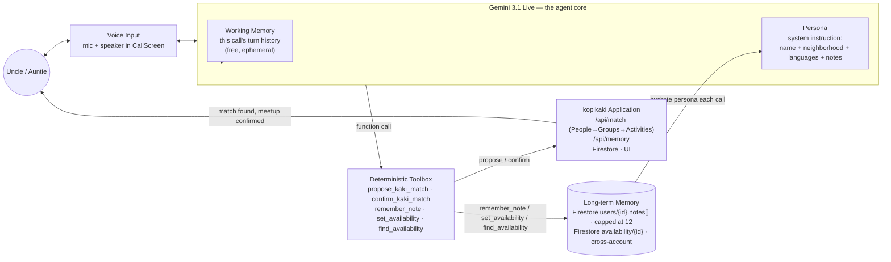

# KopiKaki — Agent Architecture

How the voice agent remembers a senior across calls and acts on it. Ties to [SPECIFICATIONS.md §4](./SPECIFICATIONS.md) (soft signals gathered through conversation, not a preference form) and the hackathon's Track 2 criteria: 40% empathy & usability, 30% contextual safety & reliability, 30% feasibility — memory is what turns "contextual safety & reliability" from a checkbox into something real.

Everything on this diagram is implemented: `LIVE_TOOLS` ([live-tools.ts](../src/lib/live-tools.ts)) is passed into `live.connect()` and `message.toolCall` is handled in [call-screen.tsx](../src/components/call-screen.tsx) — voice drives the app directly, no separate button-only path required.

## Memory model

Two tiers, not three — no need to over-model this:

- **Working memory** — the live session's own turn history. Free (Gemini already keeps it). Gone when the call ends.
- **Long-term memory**, two Firestore shapes, both defined in [memory.ts](../src/lib/memory.ts):
  - `users/{id}.notes: MemoryNote[]` — `{ text, kind: "preference" | "constraint" | "context", createdAt }`. Capped at 12 (`MAX_MEMORY_NOTES`), deduped by kind+text, oldest dropped on overflow. Private to the caller — never cross-read, same isolation as the `kakis` collection's write path.
  - `availability/{id}` — one doc per (user, activity, date, time window), id = deterministic `availabilityId(userId, activityKey, localDate, startMinute, endMinute)` so restating the same window upserts instead of duplicating. Cross-account **by design**: this is what lets one senior's "I'm free for badminton 3–4pm" answer a different senior's "who's free for badminton at 3?" — the whole point of the feature.

No subcollection, no embeddings, no vector search — short strings and small time windows fold straight into a prompt or a single-field Firestore query; reach for RAG only if this ever stops fitting (it won't, for a room of seniors' worth of facts).

`kind` on a note exists so matching could filter cheaply later (e.g. treat `constraint` as harder than `preference`) — not for UI display.

## Tools

All five live in `LIVE_TOOLS` ([live-tools.ts](../src/lib/live-tools.ts)) and are wired end-to-end (Gemini Live → `call-screen.tsx` → `/api/match` or `/api/memory` → Firestore):

- `propose_kaki_match` / `confirm_kaki_match` — the original matching flow.
- `remember_note({ text, kind })` — *"Call when the caller shares something lasting about themselves — a preference, a physical limit, or life context — not for one-off statements like being hungry right now. Never call it for something you're inferring; only for what they actually said."* That last sentence is the safety guardrail: store what was said, not a diagnosis the model derived.
- `set_availability({ activity, date, startTime, endTime, available })` — states or cancels a time window.
- `find_availability({ activity, date, startTime, endTime })` — looks up who else has an overlapping window for that activity.

`/api/memory` (POST, `requireUser` auth like every other route) hands the body straight to `parseMemoryOperation` and branches on `operation` — same shape as `/api/match`, no new pattern to learn.

## Acting on memory, not just storing it

- **Persona**: notes go into the Live system instruction every call (`buildSystemInstruction` in [live-token/route.ts](../src/app/api/live-token/route.ts)) — this alone satisfies "remember and use it in conversation."
- **Availability lookup**: `find_availability` is a direct answer to a direct question — it does not (yet) feed into `/api/match`'s People→Groups→Activities matcher. Folding a `constraint` note into `matcher.ts` filtering, or an availability window into candidate ranking, is future work, not required for the core "kopikaki remembers and can be asked" behavior.
- **Reason string**: weaving a relevant note into `/api/match`'s spoken `reason` (*"Raymond also prefers mornings, and I know Mandarin's easier for you"*) is still a stretch goal — skip if time's short.

## Safety & reliability (30% of the score)

- Notes are keyed under the caller's own `userId` doc — never cross-read, same isolation as the existing `kakis` collection.
- Availability *is* cross-read by design, but scoped to `{name, activity, startTime, endTime}` only — no more exposed than the existing `kakis` collection already exposes to any signed-in user. `firestore.rules` gives `availability` the same `allow read: if request.auth != null; allow write: if false;` shape as `kakis`/`groups`/`activities`.
- Hard cap (12) on notes means unbounded PII accumulation isn't possible by construction.
- Store verbatim short facts, not clinical inferences — keeps this out of "AI Mental Health Advisor" territory, which the hackathon brief explicitly bans.
- If `/api/memory` fails or `notes`/`availability` data is missing or malformed: degrade to today's behavior (generic greeting, no availability results) — same fallback shape already used for a malformed profile doc and for Gemini-unavailable intent parsing. Memory is additive; its absence must never break the hero flow.
