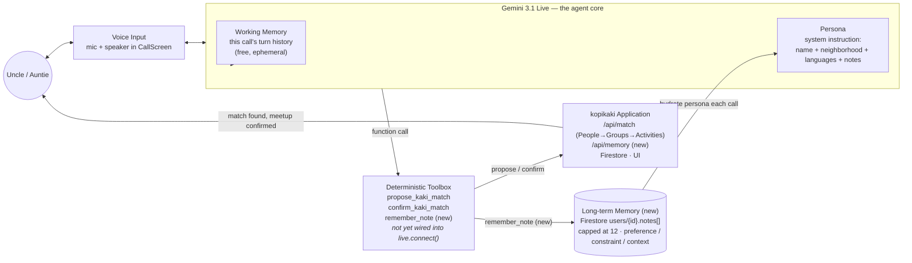

# KopiKaki — Agent Architecture (proposal)

How the voice agent remembers a senior across calls and acts on it. Ties to [SPECIFICATIONS.md §4](./SPECIFICATIONS.md) (soft signals gathered through conversation, not a preference form) and the hackathon's Track 2 criteria: 40% empathy & usability, 30% contextual safety & reliability, 30% feasibility — memory is what turns "contextual safety & reliability" from a checkbox into something real.



Everything *not* marked "(new)" already exists. `Toolbox` is declared in code ([live-tools.ts](../src/lib/live-tools.ts)) but isn't wired into the live session yet — see step 1 below, which is worth doing independent of whether memory ships.

## Current gap (why this is needed)

Two things already exist but aren't connected, and one thing doesn't exist yet:

1. [live-tools.ts](../src/lib/live-tools.ts) declares `propose_kaki_match` / `confirm_kaki_match`, and [live-token/route.ts](../src/app/api/live-token/route.ts)'s system instruction tells Gemini to call them — but [call-screen.tsx](../src/components/call-screen.tsx) never passes `tools` into `live.connect()` and never handles `message.toolCall`. Today the Live model can only talk; a separate "Find my kaki" button does the real work via transcript text. **Voice doesn't yet drive the app.**
2. `buildSystemInstruction` already reads `profile?.neighborhood` and `profile?.languages` — but `UserProfile` in [domain.ts](../src/lib/domain.ts) only has `name`. Those branches are dead; every caller gets the generic greeting.
3. Nothing persists what a senior says across calls. "My knees not so good," "recently lost my husband," "Mandarin easier" — today these live only inside one call's transcript and vanish.

The proposal below closes all three with one mechanism: wire the tool-calling loop, and add memory as one more tool in it.

## Memory model

Two tiers, not three — no need to over-model this:

- **Working memory** — the live session's own turn history. Free (Gemini already keeps it). Gone when the call ends.
- **Long-term memory** — a capped list of short facts on the user's own Firestore doc: `users/{id}.notes: MemoryNote[]`, `MemoryNote = { text: string; kind: "preference" | "constraint" | "context"; createdAt: Timestamp }`. Cap at ~12, drop oldest on overflow. No subcollection, no embeddings, no vector search — a dozen short strings folded straight into a prompt is plenty; reach for RAG only if this ever stops fitting in a system instruction (it won't, for one senior's worth of facts).

`kind` exists only so matching can filter cheaply later (e.g. treat `constraint` as harder than `preference`) — not for UI display.

## New tool: `remember_note`

Added to `LIVE_TOOLS` alongside the existing two:

```
remember_note({ text: string, kind: "preference" | "constraint" | "context" })
```

System instruction addition: *"Call remember_note when the caller shares something lasting about themselves — a preference, a physical limit, or life context — not for one-off statements like being hungry right now. Never call it for something you're inferring; only for what they actually said."* That last sentence is the safety guardrail: store what was said, not a diagnosis the model derived.

## Closing the wiring gap

- `call-screen.tsx`: pass `tools: LIVE_TOOLS` in `live.connect()` config; handle `message.toolCall.functionCalls` by POSTing to the matching route/`/api/memory` and replying with `session.sendToolResponse(...)`.
- `/api/live-token`: extend `UserProfile` (and the `users` doc) with `neighborhood`, `languages`, `notes`; fold `notes` into `buildSystemInstruction` so the persona actually knows what it's supposed to know.
- New tiny route `/api/memory` (POST, `requireUser` auth like every other route): appends one `MemoryNote`, enforces the cap. Same shape as `/api/match` — no new pattern to learn.

## Acting on memory, not just storing it

- **Persona**: notes go into the Live system instruction every call — this alone satisfies "remember and use it in conversation."
- **Matching**: `/api/match` already builds a `reason` string and calls `matchCandidates`. Pass the caller's `constraint` notes in; two cheap, high-value uses:
  - a `"no big groups"` constraint skips the `groups` tier even if it would otherwise match.
  - any `constraint` present makes `isNearby` a hard filter instead of `matcher.ts`'s current soft preference (mobility trumps a farther "better" match).
- **Reason string**: weave one relevant note in when present — *"Raymond also prefers mornings, and I know Mandarin's easier for you."* Stretch, not core — skip if time's short, the plumbing above is the part that has to work.

## Safety & reliability (30% of the score)

- Notes are keyed under the caller's own `userId` doc — never cross-read, same isolation as the existing `kakis` collection.
- Hard cap (12) means unbounded PII accumulation isn't possible by construction.
- Store verbatim short facts, not clinical inferences — keeps this out of "AI Mental Health Advisor" territory, which the hackathon brief explicitly bans.
- If `/api/memory` fails or `notes` is missing/malformed: degrade to today's behavior (generic greeting, no constraint filtering) — same fallback shape already used for a malformed profile doc and for Gemini-unavailable intent parsing. Memory is additive; its absence must never break the hero flow.

## Build order (given today's deadline)

1. Wire `LIVE_TOOLS` into `call-screen.tsx` + handle `toolCall` → existing `/api/match`. **This alone makes voice actually drive the app — do it even if memory doesn't land.**
2. Add `notes` to `UserProfile`/`users` doc, `remember_note` tool, `/api/memory` route, fold into system instruction.
3. Fold `constraint` notes into `matcher.ts` filtering. Stretch.
4. Weave a note into the spoken/written reason. Stretch, cut first if time runs out.
