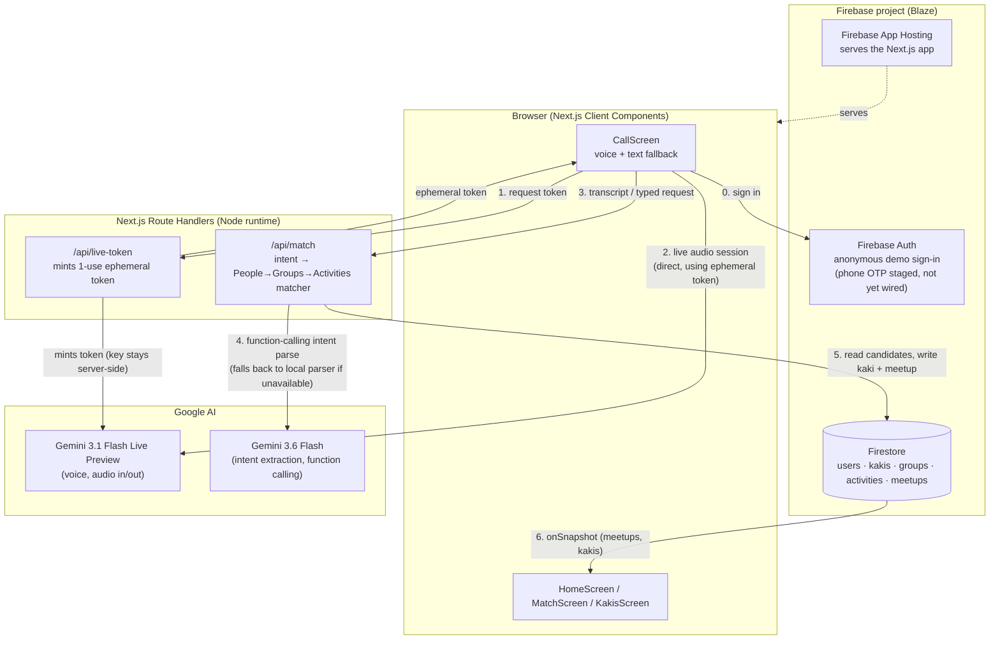

# KopiKaki — Architecture

Technical architecture and deployment. See [AGENTS.md](../AGENTS.md) for the binding stack decision and the reasoning for it; this doc is the implementation detail underneath.

## System overview

One Firebase project hosts everything: the Next.js app (frontend + backend) via Firebase App Hosting, Firestore as the database, Firebase Auth for identity. One Gemini API key, generated separately in AI Studio, stored as an App Hosting secret — it never reaches the client.

## Diagram

Current implementation state (agent/memory architecture proposal lives in [AGENT_ARCHITECTURE.md](./AGENT_ARCHITECTURE.md)):

**Note:** the section above describes voice as fully relayed through the Route Handler. In code, only token minting is server-side (`/api/live-token`) — the browser then holds a live audio session with Gemini directly using that ephemeral, single-use token. This still satisfies the AGENTS.md trust boundary ("mint ephemeral tokens **or** relay every call") — the API key itself never reaches the client — but it's a different pattern from a full relay, worth knowing if you're tracing the audio path.

## Components

- **Frontend** — Next.js App Router, Server Components by default, `"use client"` only where real interactivity needs it (the call UI, the live-updating meetup card).
- **Backend** — Next.js Route Handlers under `app/api/*`. Sole Gemini relay, sole place holding the Gemini API key. No separate Cloud Functions deploy — one deploy target, one language.
- **Data** — Firestore collections: users, kakis, meetups, activities. Realtime `onSnapshot` listeners drive the home screen card with no custom websocket layer.
- **Auth** — Firebase Auth, phone OTP. Staged in behind the hero flow — see "Build sequencing" below.
- **Voice** — Gemini 3.1 Flash Live Preview, invoked through the Route Handler relay. The browser never talks to Gemini directly.
- **Matching** — Gemini 3.6 Flash, server-side function calling over Firestore reads, People → Groups → Activities fallback order (non-negotiable, see AGENTS.md).

## Deployment

- Everything lives in **one Firebase project** (console.firebase.google.com).
- Project must be on the **Blaze (pay-as-you-go) plan** — App Hosting and phone-auth SMS both require it; the free Spark plan can't deploy either.
- `firebase init` → select App Hosting + Firestore.
- `firebase deploy` ships the Next.js app (frontend + Route Handlers) and Firestore rules together, in one command.
- Connect the App Hosting backend to the GitHub repo in the console for auto-deploy on push to `main`.
- Gemini API key: generated at aistudio.google.com, stored as an App Hosting secret — not a client env var, not committed.

## Build sequencing: auth is staged, not skipped

Real phone OTP is real infra risk (Blaze billing, SMS delivery, reCAPTCHA) that has nothing to do with what's being judged. Build and demo the hero flow against a seeded test user first; wire in real phone OTP only after the hero flow works end-to-end. Promote it back to required once there's time margin — see Scope discipline in AGENTS.md.

## Known risk

Gemini Live audio in a real mobile browser (Safari iOS especially) is the highest-risk integration point in the stack. Spike it before building UI on top of it.
