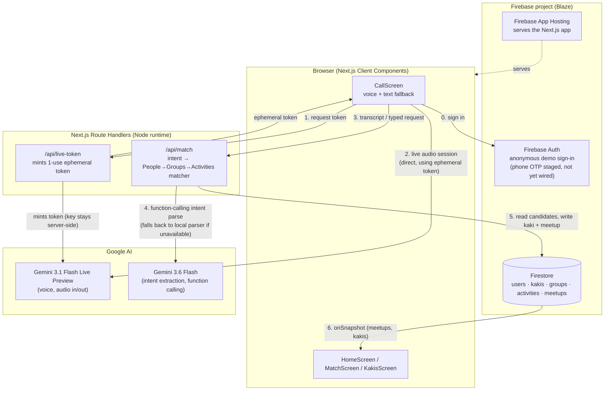

# Architecture Diagram

Current implementation state (see [ARCHITECTURE.md](./ARCHITECTURE.md) for the narrative, [AGENTS.md](../AGENTS.md) for the binding decisions). Agent/memory architecture proposal lives in [AGENT_ARCHITECTURE.md](./AGENT_ARCHITECTURE.md).

**Note:** ARCHITECTURE.md describes voice as fully relayed through the Route Handler. In code, only token minting is server-side (`/api/live-token`) — the browser then holds a live audio session with Gemini directly using that ephemeral, single-use token. This still satisfies the AGENTS.md trust boundary ("mint ephemeral tokens **or** relay every call") — the API key itself never reaches the client — but it's a different pattern from a full relay, worth knowing if you're tracing the audio path.
